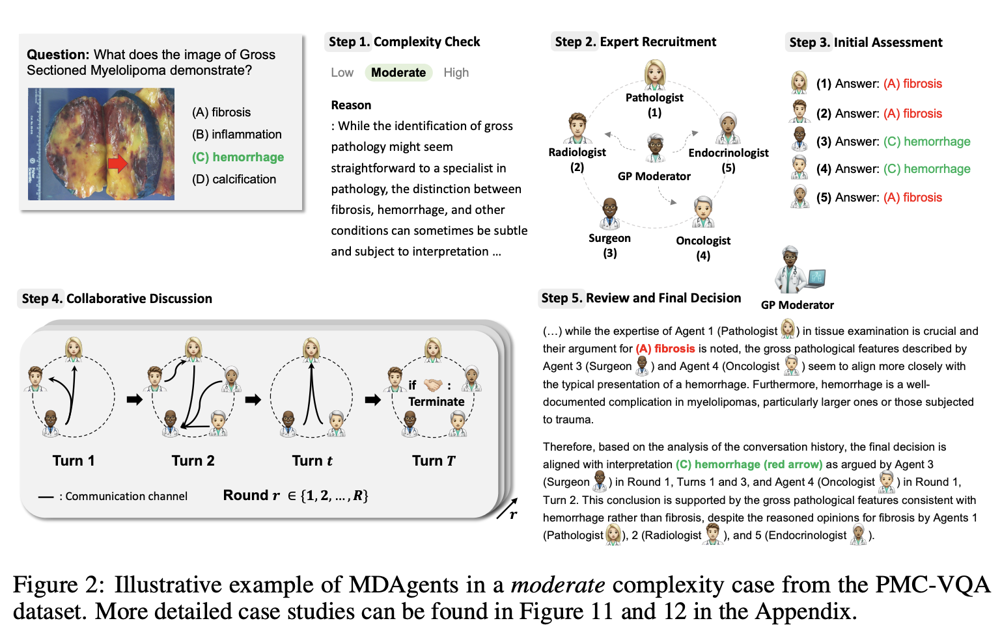
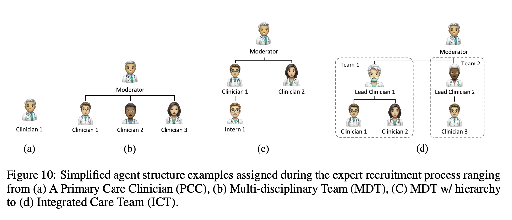
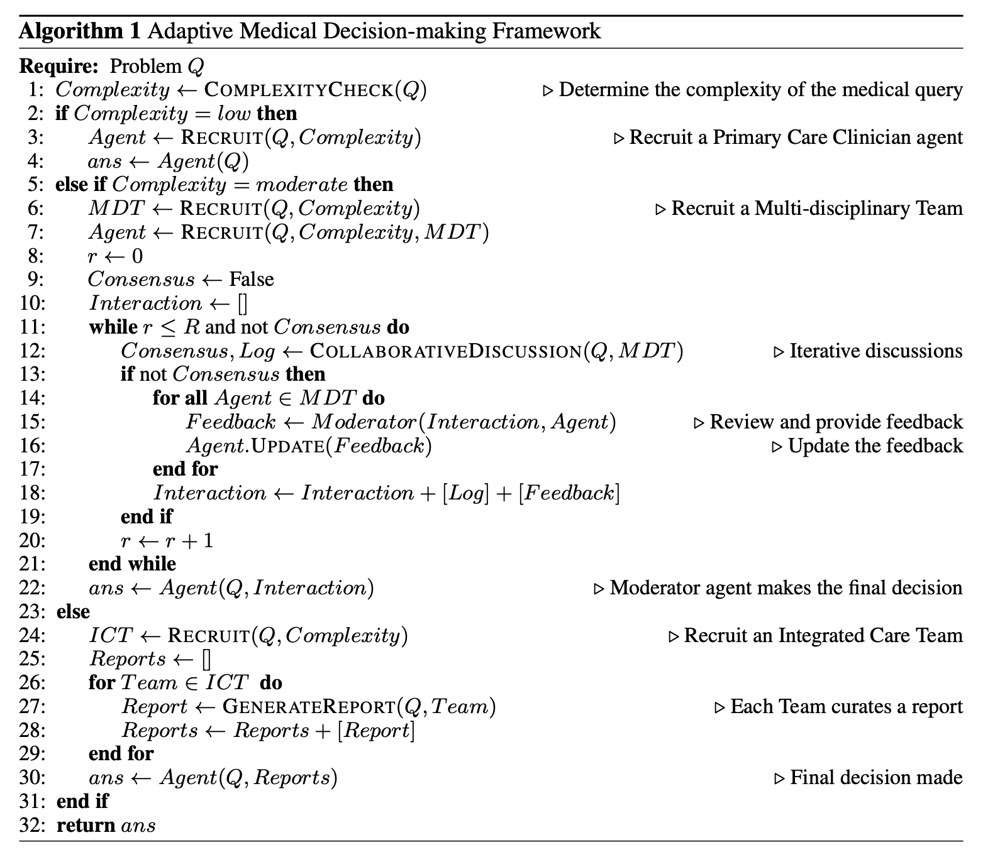

*This post is a review of the paper **MDAgents: An Adaptive Collaboration of LLMs for Medical Decision-Making** by Yubin Kim, Chanwoo Park, Hyewon Jeong, Yik Siu Chan, Xuhai Xu, Daniel McDuff, Hyeonhoon Lee, Marzyeh Ghassemi, Cynthia Breazeal, Hae Won Park*

*#few short learning, #LLM*

<h2>Background</h2>
There has been a significant breakthorugh in healthcare AI that leverage the power of foundation models. There has been many attempts to take full advantage of foundation models. The authors of this paper introduce MDAgent that utilizes foundation model to emulate real life decision making process in clinics where for a simple case one clinician diagnoses the patient whereas for complicated situations multiple clinicians, including specialists from different department, discuss and come to a conclusion. Inspired by the human approach, MDAgent analyzes the complexity of the task using LLM and recruit a single or multiple agents to answer the medical query given. For complicated queries, MDAgent mimics human behavior even deeper by forcing the agents to come to a unanimous conclusion. The significance of this paper is that the authors utilize LLM to as orchestrators and take tiered approach to diagnosze patients. MDAgent outperfomed seven out of ten benchmark models. 

<h2>Architecture</h2>

In MDAgent, there's three components. 

1. Moderator
2. Recruiter
3. General Doctor/Specialist

and three tiers
1. Low
2. Moderate
3. High

<h4>Moderator</h4>
The moderator assumes the responsiblity of general practitioner or emergency deparment doctor who first triages the patient in rea life. It assesses the medical query given and determiend which complexity tier the case should fall into.  
<h4>Recruiter</h4>
Once the moderator decides the complexity of the query - low, medium, high - the recruiter assembles prediciton agents to solve the query. Depending on the complexity, the recuiter will hire a single agent or multiple agents that corresponds to specialists in real clinics.
The authors define low, medium, and high complexity as the following:

1. Low: Usually a "common, acute illnesses, or stable chronic conditions" that typically are predictable.
2. Moderate: This condition typicall requires interdisciplinary coordination across different medical departments. 
3. High: Includes "multiple chronic conditions, complicated surgery, or trauma cases" where multiple specialists from different deparments are required. 

<h4>Expert Recuitmnet</h4>
Once the input query is fed to MedAgent, the LLM moderator assesses the query and assign one of the three complexity levels. Depending on the complexity, the recruiter will either hire a single or multiple agents from different teams and pursue varying depth of decision making process.

<h4>Medical Collaboration and Refinement</h4>

**Low**
For cases classified as low complexity, the recruiter deploys a single PCP agent. This agent applies few-shot learning prompting to the query.

**Moderate**
For cases classified as morderate complexity, MDAgent recruiter hires multiple agents and emulates MDT (Multisciplinary Team). Utilizing MDT, the authors attempt to tackle complex queries by leveraging collaboration among multiple agents which gives advantage to situations where the patient's condition is not restricted to a single department but requires in depth knowledge that span across multiple medical departments. 

Once the case is classified as moderate complexity and agents are recruited, MDAgent starts an iterative process where all agents are given *R* rounds to reach consensus. At the end of every round, the agents exchange what they have learnt and tries to reach consensus. If it's consensus, the output will be delivered. If not, the moderator intervenes to review the agents' opinions and provide feedback.   

**High**
The authors emphasize in depth analysis for solving high complexity problems. To do so, they emulate (Integrated Care Team) ICT that could enable specialized assessment and knowledge sharing of the agents. For high complexity cases, MDAgents start by Initial Assessment Team comprised of multiple teams specialized in different domains. All agents in the team analyze the condition and the lead clinician of the team gathers the information and generate a report. The reports generated as such are synthesized to a resultant report which is reviewed by the Final Review & Decision Team to provide final answer to the query.  

